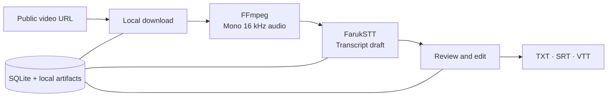

<div align="center">


# Reel Machine

**Your local workspace for Tunisian Arabic video transcripts.**

Collect public videos. Turn speech into editable drafts. Keep your next script close.

[](pyproject.toml)
[](frontend/package.json)
[](backend/app/db.py)
[](#how-it-works)

[Get started](#get-started) · [Features](#what-you-can-do) · [Configuration](#configuration) · [Development](#development)

</div>

Reel Machine is a personal video library and transcript workspace built around **Tunisian Arabic / Derja**. Save public Instagram, Facebook, and TikTok links, run speech recognition locally with FarukSTT, and review the results in a focused editor. A separate Notes space keeps your titles, descriptions, and scripts alongside your research.

The current application and optional macOS bundle are branded **Kite**. This repository contains the working transcript and script workspace; automated video editing, reel rendering, and social publishing are outside its current scope.

## What you can do

| Collect | Process | Create |
| :--- | :--- | :--- |
| Save supported public video links with metadata and local covers. | Queue FarukSTT transcription automatically when a video is added. | Edit transcript text and timestamps with saved revision history. |
| Find material by creator, tags, platform, duration, date, and text. | Pause, resume, and retry with reusable processing checkpoints. | Copy transcripts or export **TXT**, **SRT**, and **VTT**. |
| Browse finished transcripts in the **Résultat** gallery. | Follow queue positions, learned time estimates, and per-run debug logs. | Write original notes and scripts, then mark them done. |

The interface includes four themes, responsive layouts, and support for reduced motion. SQLite stores the library, revisions, notes, and job state; media and processing artifacts stay on your machine. Video retrieval needs an internet connection. Transcription uses your installed local model.

## How it works



**Next.js + React** provide the interface. **FastAPI** owns the API and workflow state. A local supervisor runs one video at a time, in queue order, and records successful steps for reuse. Instagram and Facebook use the bundled yt-dlp wrapper; TikTok uses the pinned gallery-dl adapter. FFmpeg prepares the audio before local Transformers inference.

FarukSTT is the only supported processing model. Recognition produces a draft for human review. The application does not include a dialect classifier or independently verify that a clip is Tunisian Arabic.

## Get started

The supplied launcher and desktop packaging target **macOS**; the desktop build targets **Apple Silicon**. Set up these tools before continuing:

- **Python 3.12+** and **uv**
- **Node.js and npm**, compatible with the Next.js version in [frontend/package.json](frontend/package.json)
- **FFmpeg**, including `ffprobe`, and **zsh**
- A complete local **FarukSTT** model directory, including inference weights, configuration, and tokenizer files

### 1. Clone and install dependencies

```sh
git clone https://github.com/imemdev/reel-machine.git
cd reel-machine

uv venv .venv
uv pip install -e '.[test,faruk,downloads]'
npm --prefix frontend ci
cp .env.example .env
```

The `faruk` extra installs the recognition runtime. Model weights are a separate setup step and are not included in Git. The `downloads` extra installs the media adapters, including the pinned gallery-dl version used by the TikTok integration.

### 2. Configure the local model

Edit `.env` and point `FARUKSTT_MODEL` to your complete local copy of **medyas/FarukSTT**:

```dotenv
FARUKSTT_MODEL=/absolute/path/to/FarukSTT
HF_HUB_OFFLINE=1
TRANSFORMERS_OFFLINE=1
```

Keep the offline settings from `.env.example` so processing uses installed model files. The **Settings** page reports whether the local runtime and required model files are present. The launcher does not install dependencies or download models.

### 3. Build and launch

```sh
npm --prefix frontend run build
./scripts/run-local
```

Open **[http://127.0.0.1:3001](http://127.0.0.1:3001)**. The API runs at `http://127.0.0.1:8001`; interactive API documentation is available at [/docs](http://127.0.0.1:8001/docs). Both services bind to loopback. Press **Ctrl-C** to stop them.

Rebuild the frontend after changing its source. The launcher serves the production build and refuses to start if either port is already occupied.

### 4. Make your first transcript

1. Open **Library**, choose **Add video**, and paste a supported public URL.
2. Check the preview, add tags, and save. The video enters the processing queue automatically.
3. Open the video to follow its processing steps and review the transcript when it finishes.
4. Edit the draft, copy its text, or export subtitles. Browse finished work in **Résultat** and develop your own scripts in **Notes**.

## Configuration

The launcher reads the root `.env` file. Start with [.env.example](.env.example).

| Setting | Default in the example | Purpose |
| :--- | :--- | :--- |
| `DATABASE_PATH` | `data/library.db` | SQLite library and persistent job state. |
| `ARTIFACT_ROOT` | `data/runs` | Media, prepared audio, transcripts, checkpoints, and logs. |
| `FARUKSTT_MODEL` | `${HOME}/Library/Caches/kite/FarukSTT` | Path to your local model directory. |
| `YTA_FUNCTION` | `./scripts/yta` | Instagram/Facebook download wrapper. |
| `GALLERY_DL` | `gallery-dl` | TikTok metadata command; downloads use the installed pinned adapter. |
| `FFMPEG` | `ffmpeg` | Audio conversion command. |
| `HF_HUB_OFFLINE` / `TRANSFORMERS_OFFLINE` | `1` | Keep model loading offline. |
| `ALLOW_FIXTURE_SOURCES` | `false` | Enable synthetic sources for development checks. |
| `MAX_BATCH_SIZE` | `12` | Maximum items in one manual processing request. |
| `WORKER_POLL_SECONDS` | `0.5` | Local queue polling interval. |

Database and artifact paths may be absolute or relative to the repository. Optional `PIPELINE_PROMPT_FILE` and `PIPELINE_LEDGER_FILE` settings can point to existing local context files; leave them blank when unused. The standard runtime processes **one video at a time**. `MAX_BATCH_SIZE` does not limit the total waiting queue.

## Keep control of your library

| Action | What happens |
| :--- | :--- |
| **Pause** | Stops the active job and its child processes while retaining successful checkpoints and source media. Paused jobs stay paused across restarts. |
| **Resume** | Continues the same run, reuses completed steps, and restarts the interrupted step. |
| **Retry** | Starts an explicit recovery attempt after failure, reusing compatible, validated artifacts. Failed videos do not retry endlessly. |
| **Done → Complete** | Removes source audio/video and retains the transcript and edit history as a read-only record. |
| **Delete** | Stops processing and permanently removes that video's records and artifacts. Installed model weights are retained. |

Use a single supervisor per database. Waiting work survives restarts; failed items leave the runnable queue so later videos can proceed. Transcription estimates learn from successful real runs and exclude download/audio preparation time.

<details>
<summary><strong>Troubleshooting and processing logs</strong></summary>

Open a video's **Processing history → View debug logs**. Each run records pipeline events, per-step logs, and external command output. The API endpoint `GET /api/jobs/{run_id}/logs` shows up to the last 64 KiB of each log file; full files stay in the artifact directory.

- **Model shows “Setup”**: check the `faruk` dependencies and ensure `FARUKSTT_MODEL` points to a complete local directory.
- **A source cannot be downloaded**: confirm it is public and supported. Platform availability varies; one successful post does not guarantee every post will work.
- **TikTok reports missing audio**: an explicit Retry invalidates the unusable download checkpoint and fetches again. Prior run logs remain available.
- **Queue estimates are missing**: the app needs known audio duration and recent successful transcription samples before it can estimate reliably.
- **Changes do not appear**: rebuild the frontend and restart. An installed desktop bundle requires its own rebuild.

Logs can include source URLs, local paths, and tool output. Review them before attaching them to an issue.

</details>

## Development

```sh
.venv/bin/python -m pytest -q
.venv/bin/python -m compileall -q backend
npm --prefix frontend run typecheck
npm --prefix frontend run build
```

Backend tests use temporary databases and fixture sources. They exercise persistence, transcripts, processing controls, estimates, notes, thumbnails, and lifecycle behavior without requiring live platform downloads or model inference. Fixture success does not measure real transcription accuracy.

```text
reel-machine/
├── backend/app/         FastAPI, SQLite, worker, and media pipeline
├── backend/tests/       API and workflow regression tests
├── frontend/            Next.js interface and transcript editor
├── desktop/             Optional Electron packaging for macOS
├── scripts/             Local launcher and download wrapper
├── docs/                Setup and architecture documentation
└── .env.example         Configuration template
```

Local environments, `.env`, model weights, generated media, databases, and packaged builds are excluded from Git. To try synthetic sources manually, enable `ALLOW_FIXTURE_SOURCES` and use separate database and artifact paths.

## Desktop and documentation

- **[macOS desktop guide](desktop/README.md)** — Electron packaging, local data, application lifecycle, and rebuild instructions. Packaging is intended for local use; a notarized public installer is not included.
- **[Local setup guide](docs/LOCAL-SETUP.md)** — environment setup and operational details.
- **[Original technical design](docs/TECHNICAL-DESIGN.md)** — historical architecture notes; some model-selection and setup details predate the current FarukSTT-only workflow.

This is a personal local application without user accounts or hosted transcription. Use public content you have permission to retrieve and process, and review transcript drafts before reusing them.

---

<div align="center">

**From saved clips to words you can work with.**

</div>
