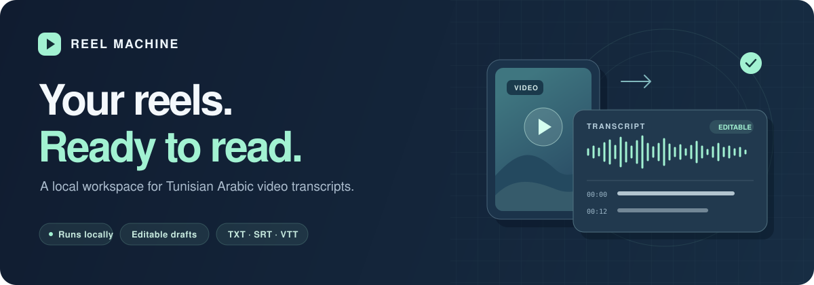
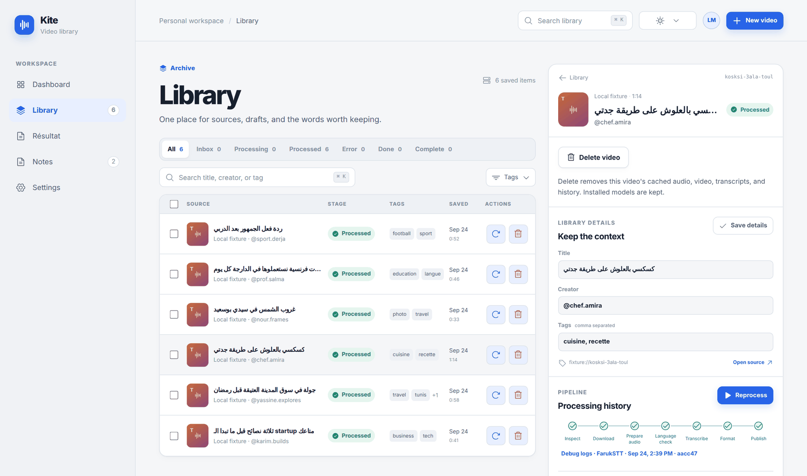
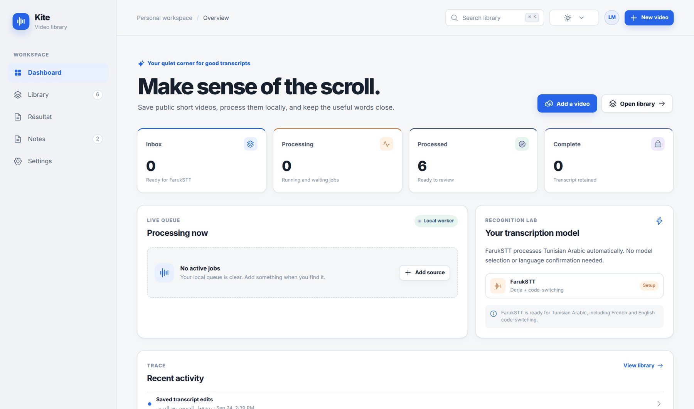
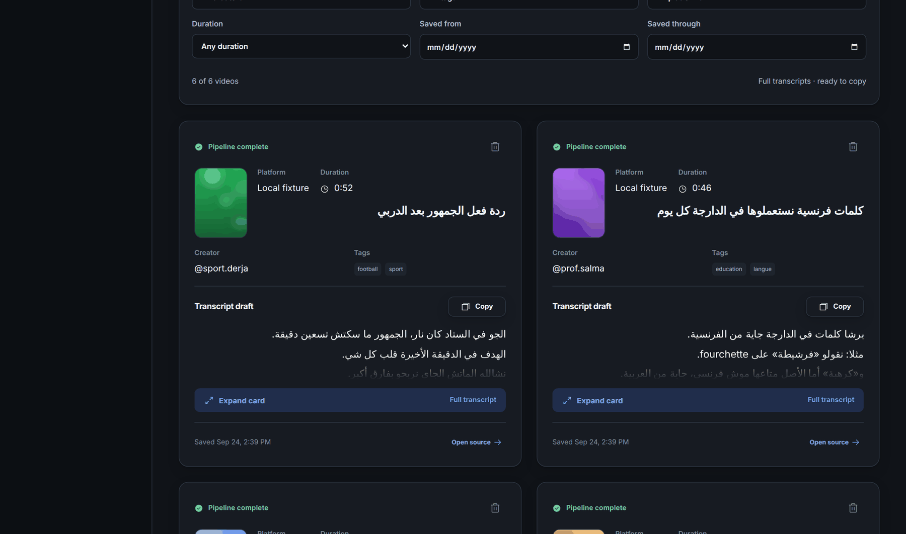
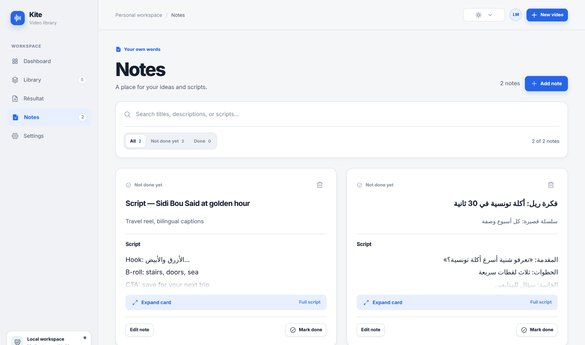
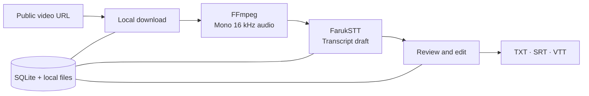

<div align="center">



# Reel Machine

**Your local workspace for Tunisian Arabic video transcripts.**

Save public reels. Turn speech into editable drafts. Keep your next script close.

[](pyproject.toml)
[](frontend/package.json)
[](backend/app/db.py)
[](#-install-and-launch)

[Screenshots](#-a-quick-look) · [Install on macOS](#-macos) · [Install on Windows](#-windows) · [First transcript](#-your-first-transcript) · [Troubleshooting](#-troubleshooting)

<br />



</div>

## 👋 What is it?

Reel Machine is a personal video library and transcript editor built for **Tunisian Arabic (Derja)**, including the French and English words people mix in.

Paste a public Instagram, Facebook, or TikTok link, and Reel Machine downloads the audio, runs speech recognition **on your own computer** with the [FarukSTT](https://huggingface.co/medyas/FarukSTT) model, and gives you a clean draft to review, edit, and export. A Notes space keeps your own ideas and scripts next to your research.

> The app window is branded **Kite**. Nothing is uploaded to a cloud service: your library, media, and transcripts stay on your machine.

## 📸 A quick look

<table>
  <tr>
    <td width="50%"></td>
    <td width="50%"></td>
  </tr>
  <tr>
    <td align="center"><b>Dashboard</b> — queue at a glance</td>
    <td align="center"><b>Résultat</b> — every finished transcript, ready to copy</td>
  </tr>
  <tr>
    <td width="50%"></td>
    <td width="50%">

**Also inside**

- ✍️ Transcript editor with timestamps and revision history
- 📤 Export to **TXT**, **SRT**, and **VTT**
- ⏯️ Pause, resume, and retry jobs without losing progress
- 🔎 Filter by creator, tag, platform, duration, and date
- 🎨 Four themes: Light, Warm Paper, Slate, Dark

</td>
  </tr>
  <tr>
    <td align="center"><b>Notes</b> — your own scripts and ideas</td>
    <td></td>
  </tr>
</table>

<sub>Screenshots use sample data with fictional creators.</sub>

## 🧰 What you need

| Tool | Why | macOS | Windows |
| :--- | :--- | :--- | :--- |
| **Git** | Download the code | `brew install git` | `winget install Git.Git` |
| **uv** | Installs Python 3.12 and the Python packages | `brew install uv` | `winget install astral-sh.uv` |
| **Node.js 20+** | Builds and serves the interface | `brew install node` | `winget install OpenJS.NodeJS.LTS` |
| **FFmpeg** | Converts audio for recognition | `brew install ffmpeg` | `winget install Gyan.FFmpeg` |
| **Disk space** | App + FarukSTT model | about **10 GB** free | about **10 GB** free |

On macOS, install [Homebrew](https://brew.sh) first if you don't have it. On Windows, `winget` is built into Windows 10 and 11. **Close and reopen your terminal after installing** so the new commands are found.

## 🚀 Install and launch

### 🍎 macOS

Open **Terminal** and run these blocks one at a time.

**1. Download the project**

```sh
cd ~/Documents
git clone https://github.com/imemdev/reel-machine.git
cd reel-machine
```

**2. Install everything**

```sh
uv venv --python 3.12 .venv
uv pip install -e '.[test,faruk,downloads]'
npm --prefix frontend ci
cp .env.example .env
```

**3. Download the FarukSTT model** (one time, several GB)

```sh
.venv/bin/hf download medyas/FarukSTT --local-dir ~/models/FarukSTT
```

Then open `.env` in any text editor (for example `open -e .env`) and set:

```dotenv
FARUKSTT_MODEL=${HOME}/models/FarukSTT
```

**4. Build and launch**

```sh
npm --prefix frontend run build
./scripts/run-local
```

Open **http://127.0.0.1:3001** in your browser. 🎉 Press **Ctrl + C** in Terminal to stop.

**Next time**, you only need:

```sh
cd ~/Documents/reel-machine
./scripts/run-local
```

### 🪟 Windows

Open **PowerShell** (Start menu → type *PowerShell*) and run these blocks one at a time.

**1. Download the project**

```powershell
cd $HOME\Documents
git clone https://github.com/imemdev/reel-machine.git
cd reel-machine
```

**2. Install everything**

```powershell
uv venv --python 3.12 .venv
uv pip install -e ".[test,faruk,downloads]"
npm --prefix frontend ci
Copy-Item .env.example .env
```

**3. Download the FarukSTT model** (one time, several GB)

```powershell
.venv\Scripts\hf.exe download medyas/FarukSTT --local-dir $HOME\models\FarukSTT
```

Then open `.env` with `notepad .env` and set the model path with **forward slashes** (replace `YOUR_NAME` with your Windows user name):

```dotenv
FARUKSTT_MODEL=C:/Users/YOUR_NAME/models/FarukSTT
```

**4. Build and launch**

```powershell
npm --prefix frontend run build
.\scripts\run-local.cmd
```

Open **http://127.0.0.1:3001** in your browser. 🎉 Press **Ctrl + C** in PowerShell to stop.

**Next time**, open the `reel-machine` folder and double-click `scripts\run-local.cmd`, or run:

```powershell
cd $HOME\Documents\reel-machine
.\scripts\run-local.cmd
```

> [!NOTE]
> Windows support is new. Everything is set up to work natively in PowerShell, but if you hit a problem, please [open an issue](https://github.com/imemdev/reel-machine/issues) with the error text.

### 🔄 Updating to a new version

```sh
git pull
uv pip install -e '.[test,faruk,downloads]'     # Windows: ".[test,faruk,downloads]"
npm --prefix frontend ci
npm --prefix frontend run build
```

Your `.env`, library, and model files are kept.

## 🎬 Your first transcript

1. Open **Library** and click **New video**.
2. Paste a public Instagram, Facebook, or TikTok link, check the preview, add tags, and save.
3. The video joins the queue automatically. Open it to watch each step: download → prepare audio → transcribe.
4. Review the draft, fix any words, then **copy** the text or export **TXT / SRT / VTT**.
5. Find everything finished in **Résultat**, and write your own scripts in **Notes**.

Transcription speed depends on your computer. The first run loads the model and takes longer; the app learns and shows time estimates after a few videos.

## ⚙️ How it works



**Next.js + React** power the interface on port `3001`. **FastAPI** runs the API on port `8001` (interactive docs at [/docs](http://127.0.0.1:8001/docs)). Both only listen on your own computer. A local worker processes **one video at a time**, in order, and saves checkpoints so finished steps are never repeated. Instagram and Facebook use yt-dlp; TikTok uses a pinned gallery-dl adapter.

FarukSTT produces a **draft** for human review. The app does not verify that a clip is actually Tunisian Arabic.

## 🎛️ Controls

| Action | What happens |
| :--- | :--- |
| **Pause** | Stops the job but keeps finished steps. Stays paused after restarts. |
| **Resume** | Continues from the last finished step. |
| **Retry** | Tries a failed job again, reusing anything still valid. |
| **Done → Complete** | Deletes the audio/video, keeps the transcript as a read-only record. |
| **Delete** | Removes the video and all its files. The model is kept. |

## 🔧 Configuration

Settings live in `.env` (copied from [.env.example](.env.example)).

| Setting | Default | Purpose |
| :--- | :--- | :--- |
| `FARUKSTT_MODEL` | `${HOME}/Library/Caches/kite/FarukSTT` | Folder with the downloaded model. **Set this.** |
| `DATABASE_PATH` | `data/library.db` | Your library database. |
| `ARTIFACT_ROOT` | `data/runs` | Media, audio, transcripts, and logs. |
| `FFMPEG` | `ffmpeg` | FFmpeg command or full path. |
| `YTA_FUNCTION` | `./scripts/yta` | Instagram/Facebook downloader (macOS). Windows uses `scripts/yta.py` automatically. |
| `GALLERY_DL` | `gallery-dl` | TikTok metadata command. |
| `HF_HUB_OFFLINE` / `TRANSFORMERS_OFFLINE` | `1` | Keep model loading fully offline. |
| `ALLOW_FIXTURE_SOURCES` | `false` | Enables fake `fixture://` sources for testing. |

Paths can be absolute or relative to the project folder.

## 🩺 Troubleshooting

<details>
<summary><b>The model shows “Setup” in Settings</b></summary>

`FARUKSTT_MODEL` must point to the complete model folder (with `config.json`, `preprocessor_config.json`, `tokenizer_config.json`, and the `.safetensors` weights). Check the path in `.env`, then restart the app. On Windows, use forward slashes.
</details>

<details>
<summary><b>“Port 8001/3001 is already in use”</b></summary>

Reel Machine is probably already running in another terminal window. Stop it with Ctrl + C there, or restart your computer.
</details>

<details>
<summary><b>“Missing frontend build”</b></summary>

Run `npm --prefix frontend run build`, then launch again. Rebuild after every update.
</details>

<details>
<summary><b>Windows: “running scripts is disabled on this system”</b></summary>

Use `.\scripts\run-local.cmd` instead of the `.ps1` file, or run once:
`Set-ExecutionPolicy -Scope CurrentUser RemoteSigned`.
</details>

<details>
<summary><b>`uv`, `node`, or `ffmpeg` is “not recognized” / “command not found”</b></summary>

Close and reopen the terminal after installing them. On Windows, sign out and back in if it still isn't found.
</details>

<details>
<summary><b>A video can't be downloaded</b></summary>

Make sure the post is public. Platforms change often; update with `uv pip install -U yt-dlp` and retry. Open the video → **Processing history → View debug logs** for details. Logs can contain URLs and local paths, so review them before sharing.
</details>

## 🧑‍💻 Development

```sh
.venv/bin/python -m pytest -q               # Windows: .venv\Scripts\python.exe -m pytest -q
.venv/bin/python -m compileall -q backend
npm --prefix frontend run typecheck
npm --prefix frontend run build
```

Tests use temporary databases and fake sources, so they need no network or model.

```text
reel-machine/
├── backend/app/         FastAPI, SQLite, worker, and media pipeline
├── backend/tests/       API and workflow tests
├── frontend/            Next.js interface and transcript editor
├── desktop/             Optional Electron packaging (macOS, Apple Silicon)
├── scripts/             Launchers for macOS and Windows, download wrappers
└── docs/                Setup guide, architecture notes, images
```

More detail: [Local setup guide](docs/LOCAL-SETUP.md) · [macOS desktop app](desktop/README.md) · [Technical design](docs/TECHNICAL-DESIGN.md) (historical).

## 🤝 Good to know

This is a personal, local-only app: no accounts, no hosted transcription. Only process content you have permission to use, and review transcript drafts before reusing them.

---

<div align="center">

**From saved clips to words you can work with.** ✨

If Reel Machine helps you, consider giving it a ⭐

</div>
